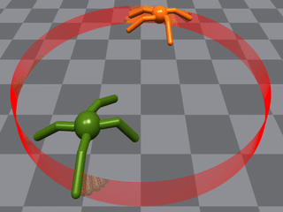

# TimeChamber: A Large Scale Self-Play Framework via Parallel Techniques

****

**TimeChamber** is a large scale self-play framework running on parallel simulation.
Running self-play algorithms always needs lots of hardware resources, especially on 3D physically simulated
environments.
We provide a self-play framework that can achieve fast training and evaluation with limited hardware resources.
TimeChamber is developed with the following key features:

- **Parallel Simulation**: TimeChamber is built within [Isaac Gym](https://developer.nvidia.com/isaac-gym). Isaac Gym is
  a fast GPU-based simulation platform.
  It supports running thousands of environments in parallel on a single GPU.
- **Parallel Evaluation**: Inspired by Vectorization techniques
  for [fast population-based training](https://github.com/instadeepai/fastpbrl), we leverage the
  vectorized models to evaluate different policy in parallel. TimeChamber can fast calculate dozens of policies' elo
  rating(represent their battle force). It also supports multi-player elo calculations
  by [multi-elo](https://github.com/djcunningham0/multielo).
- **Prioritized Fictitious Self-Play Benchmark**: We implement a classic PPO-self-play algorithm on top
  of [rl_games](https://github.com/Denys88/rl_games).
  We provide a prioritized player pool to avoid cycles and improve the diversity of training policy.
- **Competitive Multi-Agent Tasks**: We introduce some competitive multi-agent tasks(e.g.,[Ant Sumo](#Ant Sumo), [Ant
  Battle](#Ant Battle)).
  These tasks test the efficiency of our self-play framework. After days of training,our agent can discover some
  physical skills like pulling, jumping,etc.

## Installation

****
Download and follow the installation instructions of Isaac Gym: https://developer.nvidia.com/isaac-gym  
Ensure that Isaac Gym works on your system by running one of the examples from the `python/examples`
directory, like `joint_monkey.py`. Please follow troubleshooting steps described in the Isaac Gym Preview Release 3/4
install instructions if you have any trouble running the samples.  
Then install this repo:

```bash
pip install -e .
```

## Quick Start

****

### Tasks

Source code for tasks can be found in  `timechamber/tasks`, more interesting tasks will come soon(wellcome to
contribute)

#### Ant Sumo

Ant Sumo is a 3D environment with simulated physics that allows pairs of ant agents to compete against each other.
To win, the agent has to push the opponent out of the ring. If the agent's body touch the ground, it will reduce hp
until death.
<div align=center>

</div> 

#### Ant Battle

Ant Battle is an expanded environment of Ant Sumo. It supports more than two agents compete against with
each other. The battle ring radius will shrink, the agent which out of the ring will be eliminated.
<div align=center>

</div>  

### Self-Play Training

To Train your policy for tasks, for example:

```bash
# run self-play training for Ant Sumo task
python train.py task=MA_Ant_Sumo
```

```bash
# run self-play training for Ant Battle task
python train.py task=MA_Ant_Battle
```

Key arguments to the training script
follow [IsaacGymEnvs Configuration and command line arguments](https://github.com/NVIDIA-Omniverse/IsaacGymEnvs/blob/main/README.md#configuration-and-command-line-arguments)
.
Other training arguments follow [rl_games config parameters](https://github.com/Denys88/rl_games#config-parameters),
you can change them in `timechamber/tasks/train/*.yaml`. There are some specific arguments for self-play training:

- `num_agents`: Set the agents number for Ant Battle environment, it should larger than 1.
- `op_checkpoint`: Set to path to the checkpoint to load initial opponent agent policy.
  If it's empty, opponent agent will use random policy.
- `update_win_rate`: Win_rate threshold to add the current policy to opponent's player_pool.
- `player_pool_length`: The max size of player pool, following FIFO rules.
- `games_to_check`: Warm up for training, the player pool won't be updated until the current policy plays such number of
  games.
- `max_update_steps`: If current policy update iterations exceed that number, the current policy will be added to
  opponent player_pool.

### Policies Evaluation

To evaluate your policies, for example:

```bash
# run testing for Ant Sumo policy
python train.py task=MA_Ant_Sumo test=True checkpoint='runs/MA_Ant_Sumo/nn/policy_1.pth'
```

You can set the opponent agent policy using `op_checkpoint`. If it's empty, the opponent agent will use the same policy
as `checkpoint`.  
We use vectorized models to accelerate the evaluation of policies. Put policies into dir, let them compete with each
other in parallel:

```bash
# run testing for Ant Sumo policy
python train.py task=MA_Ant_Sumo test=True checkpoint='runs/MA_Ant_Sumo/nn/policy_dir'
```

There are some specific arguments for self-play evaluation, you can change them in `timechamber/tasks/train/*.yaml`:

- `games_num`: Total episode numbers of evaluation.
- `record_elo`: Set `True` to record the elo rating of your policies, after evaluation, you can check the `elo.jpg` in
  your checkpoint dir.
- `init_elo`: Initial elo rating of each policy.

### Building Your Own Task

You can build your own task
follow [IsaacGymEnvs](https://github.com/NVIDIA-Omniverse/IsaacGymEnvs/blob/main/README.md#creating-an-environment)
, make sure the obs shape is correct and`info` contains `win`,`lose`and`draw`:

```python
import isaacgym
import timechamber
import torch

envs = timechamber.make(
    seed=0,
    task="MA_Ant_Sumo",
    num_envs=2,
    sim_device="cuda:0",
    rl_device="cuda:0",
)
# the obs shape should be (num_agents*num_envs,num_obs).
# the obs of training agent is (:num_envs,num_obs)
print("Observation space is", envs.observation_space)
print("Action space is", envs.action_space)
obs = envs.reset()
for _ in range(20):
    obs, reward, done, info = envs.step(
        torch.rand((2 * 2,) + envs.action_space.shape, device="cuda:0")
    )
# info:
# {'win': tensor([Bool, Bool])
# 'lose': tensor([Bool, Bool])
# 'draw': tensor([Bool, Bool])}

```

## Citing

If you use timechamber in your research please use the following citation:

````
@misc{InspirAI,
  author = {ZeldaHuang,Flood Sung},
  title = {TimeChamber: A Large Scale Self-Play Framework via Parallel Techniques},
  year = {2022},
  publisher = {GitHub},
  journal = {GitHub repository},
  howpublished = {\url{https://github.com/inspirai/TimeChamber}},
}